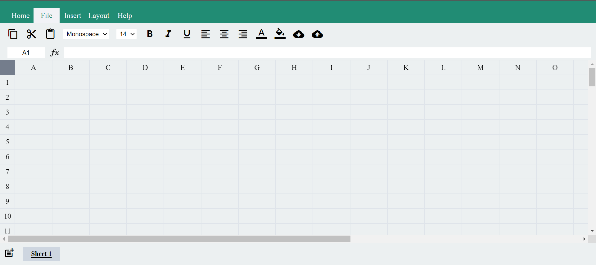
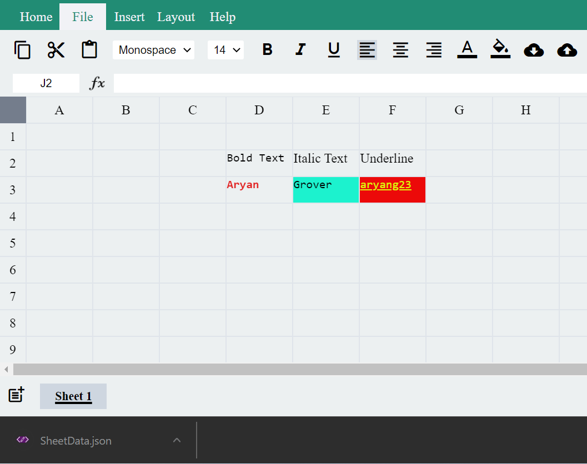

# Excel Clone

A brief description of what this project does and who it's for

This is Excel Clone with very good features.

1. You can add text, change styling like bold, italics and underline of the text.

2. You can also change the Color of Text and Color of a specific box.

3. You can also apply calculations features like C1 = (A1 * B1) and I also have applied Cyclic Checking for that.

4. You can even download your excel files and upload your direct JSON files to directly work with the Excel.

## Demo

Live Link: -

https://aryang23.github.io/Excel-Clone/
## Features

- Text Styling
- Text Color Change
- Perform Calculations between Cells
- Download/ Upload
- Add Sheets

## Screenshots

# Image 0

# Image 1

# Image 2

# Image 3

## 🚀 About Me
I'm a full stack developer...
You can check more about me at: - github.com/aryang23

